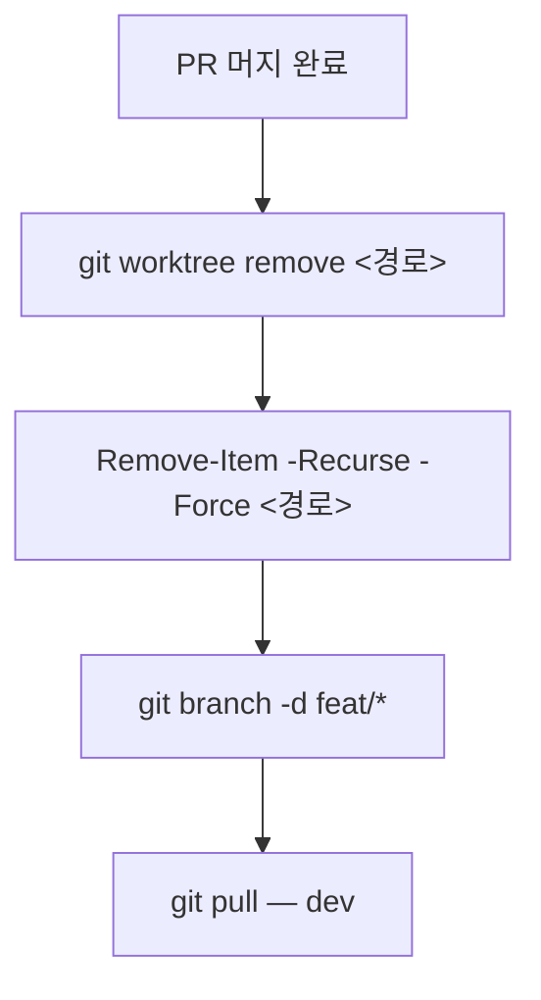

<!-- BEGIN:nextjs-agent-rules -->
# This is NOT the Next.js you know

This version has breaking changes — APIs, conventions, and file structure may all differ from your training data. Read the relevant guide in `node_modules/next/dist/docs/` before writing any code. Heed deprecation notices.
<!-- END:nextjs-agent-rules -->

# Git 전략 

## 브랜치 흐름

- `<prefix>/*` → `dev` → `main`
- `feat/*` 브랜치를 `main`에 직접 병합하지 않는다
- `dev` 검증 없이 `main`에 병합하지 않는다
- 충돌 해결은 `feat/*` → `dev` 단계에서 한다 (`main`에서 하지 않는다)
- 머지 완료된 로컬 브랜치는 즉시 삭제한다 (`git branch -d`)

## dev→main 병합 시 제외 대상

`main`은 배포 소스만 유지한다. 개발 하네스/도구 로컬 설정(`.claude/`, `.playwright/`, `TODO.md`)은 `dev`에선 정상 추적하되 `main`엔 절대 넘어가지 않아야 한다.

- `main`의 `.gitattributes`에 해당 경로 `merge=ours` 지정돼있음 — `dev→main` 병합 시 이 경로들은 자동으로 스킵(main 쪽엔 애초에 없으니 계속 없는 채로 유지, 충돌도 안 남)
- **로컬 git config 필요**: `git config merge.ours.driver true` — 이건 레포에 커밋되지 않는 로컬 설정이라, 새로 클론하거나 새 머신에서 작업할 땐 `main`으로 병합하기 전에 반드시 먼저 실행해야 한다. 안 해두면 `merge=ours` 지정이 무시되고 하네스 파일이 그대로 main에 딸려 들어간다

## 브랜치 prefix 컨벤션

| prefix      | 용도                          |
| ----------- | ----------------------------- |
| `feat/`     | 새 기능 추가                  |
| `fix/`      | 버그 수정                     |
| `docs/`     | 문서 작성·수정                |
| `refactor/` | 코드 리팩토링                 |
| `chore/`    | 설정·빌드·패키지 등 기타 작업 |
| `test/`     | 테스트 추가·수정              |

## Git Worktree

- 순차 작업에 worktree를 사용하지 않는다 — 병렬 작업이 필요할 때만 생성한다
- worktree 디렉토리명에 브랜치명을 반영한다
- 같은 브랜치를 두 worktree에 동시에 체크아웃하지 않는다

### Worktree 생성

새 브랜치를 만들면서 worktree를 생성할 때는 반드시 `-b` 플래그를 사용한다.
존재하지 않는 브랜치명을 `-b` 없이 지정하면 `invalid reference` 에러가 발생한다.

```bash
# 새 브랜치 + worktree 동시 생성 (기반 브랜치에서 분기)
git worktree add -b <브랜치명> <경로> <기반브랜치>

# 예시
git worktree add -b feat/some-feature ../film-wiki-feat-some-feature dev

# 이미 존재하는 브랜치를 체크아웃할 때는 -b 없이 사용
git worktree add <경로> <브랜치명>
```

### Worktree 정리 워크플로우



# 네이밍 컨벤션

`src/app`/`src/components`/`src/lib` 전체에 동일 적용한다.

## 파일명 (아티팩트 타입별)

| 아티팩트         | 케이스                    | 예                  |
| ---------------- | ------------------------- | ------------------- |
| 컴포넌트         | PascalCase                | `PersonLink.tsx`    |
| 훅               | camelCase, `use` 접두사 필수 | `useSearchInfinite.ts` |
| 타입/인터페이스  | PascalCase                | `KeyCrewPerson.ts`  |
| 순수함수/유틸    | camelCase                 | `formatRuntime.ts`  |
| 상수             | camelCase                 | `keyCrewJobs.ts`     |

- 배럴 파일은 위 표와 무관하게 `index.ts`(컴포넌트 배럴은 `index.tsx`)로 고정한다.
- 아티팩트 타입에 케이스를 맞추지 않는다(예: 컴포넌트를 kebab-case로 만들지 않는다) — 파일명만 보고 안에 뭐가 있는지 구분되어야 한다.

## Export 식별자 케이스 (상수)

- 원시 리터럴 고정값(매직 넘버/문자열 대체용)은 SCREAMING_SNAKE_CASE로 export한다.
  예: `export const BLUR_DATA_URL = "..."` (`src/lib/tmdb/images.ts`)
- 구조화된 설정/프리셋 객체(variants, transition 등 필드 여러 개)는 camelCase로 export한다.
  예: `export const cardSpring: Transition = {...}` (`src/lib/motion.ts`)
- 판단 기준: 값 하나로 의미가 끝나면 리터럴(UPPERCASE), 여러 필드를 가진 구조/동작 정의면 프리셋(camelCase).

# 폴더 배치 판단

- 파일을 새로 만들거나 옮길 때 네이밍 케이스만 맞추고 넘어가지 않는다 — 대상 폴더 `CLAUDE.md` 정의 문단과 성격이 맞는지 먼저 확인한다.
- 성격이 대상 폴더 정의와 안 맞으면 그대로 두지 않는다 — 후보가 될 다른 `src/*` 폴더들의 `CLAUDE.md` 정의와 비교해 가장 맞는 곳으로 옮긴다.
- 어느 폴더 정의와도 안 맞으면 기존 폴더에 임의로 끼워넣지 않는다 — 새 폴더를 만들거나 사용자에게 확인한다.
- 후보 폴더 `CLAUDE.md` 비교 시 키워드 grep 매칭 결과만으로 "관련 규정 없음"이라 결론짓지 않는다 — 규칙이 다른 표현(예: provider 대신 "외부 상태관리 라이브러리")으로 적혀 있을 수 있으니 후보 문서는 전체를 통독한다.
