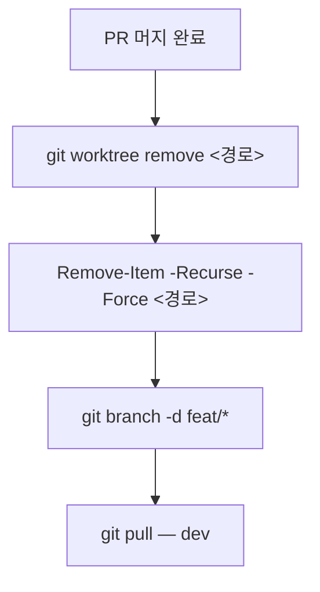

# Git 전략 

## 브랜치 흐름

- `<prefix>/*` → `dev` → `main`
- `feat/*` 브랜치를 `main`에 직접 병합하지 않는다
- `dev` 검증 없이 `main`에 병합하지 않는다
- 충돌 해결은 `feat/*` → `dev` 단계에서 한다 (`main`에서 하지 않는다)
- 머지 완료된 로컬 브랜치는 즉시 삭제한다 (`git branch -d`)

## dev→main 병합 시 제외 대상

`main`은 배포 소스만 유지한다. 개발/기획 프로세스 산출물(`.claude/`, `.playwright/`, `.vscode/`, `TODO.md`, `AGENTS.md`, `docs/`, `src/` 하위 각 레이어에 흩어진 `CLAUDE.md`)은 `dev`에선 정상 추적하되 `main`엔 절대 넘어가지 않아야 한다.

- `.gitattributes`의 `merge=ours`로는 이 문제를 못 푼다 — `merge=ours`는 양쪽에 다 있고 내용이 다를 때만 개입하고, main엔 없고 dev에만 있는 신규 파일(add-only)은 그냥 통과시켜버린다(dry-run으로 확인됨). 시도했다가 되돌린 이력 있음
- 대신 `scripts/release-to-main.sh`로 릴리스한다 — `dev`에서 실행하면 `main`으로 전환 후 `git merge --no-commit`으로 스테이징하고, 제외 경로(스크립트 상단 `EXCLUDE_PATHS` 배열 + `find`로 잡는 전체 `CLAUDE.md`)를 `git rm --cached`로 인덱스에서 뺀 뒤 커밋 직전에 멈춘다 — 최종 커밋/push는 직접 확인 후 수동으로 한다

## 브랜치 prefix 컨벤션

| prefix      | 용도                          |
| ----------- | ----------------------------- |
| `feat/`     | 새 기능 추가                  |
| `fix/`      | 버그 수정                     |
| `docs/`     | 문서 작성·수정                |
| `refactor/` | 코드 리팩토링                 |
| `chore/`    | 설정·빌드·패키지 등 기타 작업 |
| `test/`     | 테스트 추가·수정              |

## Git Worktree

- 순차 작업에 worktree를 사용하지 않는다 — 병렬 작업이 필요할 때만 생성한다
- worktree 디렉토리명에 브랜치명을 반영한다
- 같은 브랜치를 두 worktree에 동시에 체크아웃하지 않는다

### Worktree 생성

새 브랜치를 만들면서 worktree를 생성할 때는 반드시 `-b` 플래그를 사용한다.
존재하지 않는 브랜치명을 `-b` 없이 지정하면 `invalid reference` 에러가 발생한다.

```bash
# 새 브랜치 + worktree 동시 생성 (기반 브랜치에서 분기)
git worktree add -b <브랜치명> <경로> <기반브랜치>

# 예시
git worktree add -b feat/some-feature ../film-wiki-feat-some-feature dev

# 이미 존재하는 브랜치를 체크아웃할 때는 -b 없이 사용
git worktree add <경로> <브랜치명>
```

### Worktree 정리 워크플로우

